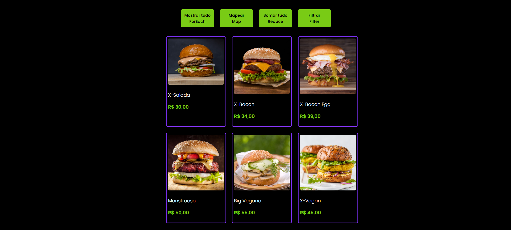

<h1>
Desafio Map, Reduce e Filter
</h1>

<h2>
📕 Sobre o projeto 
</h2>

Esse projeto foi desenvolvido durante as aulas do DevClub. Consiste em um exercício de utilização do map, reduce e filter. Utilizamos o comando foreach para mostrar todas as opções do cardápio na tela, o map para dar um desconto nos produtos, o reduce para somar todos os valores dos produtos, e o filter para filtras os produtos veganos de uma hamburgueria.

<h2>
🔨 Ferramentas
</h2> 

<ul>
<li>HTML</li>
<li>CSS</li>
<li>Javascript</li>
</ul>

